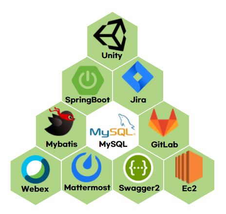
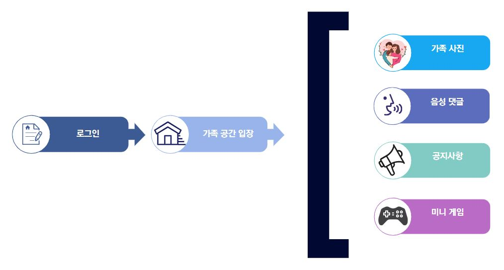

# 📑 프로젝트 소개

- **진행기간**: 2021.04.12 ~ 2021.05.20

- **이름**: 모여봐요 가족의 숲

- **목표**

  - 가족만의 공간을 제공

  - 가족과 함께 사진을 공유하고 음성으로 댓글을 남겨 추억을 기록

  - 간단한 게임을 통해 오락적인 요소를 제공

  - 가족 공지를 통해 중요한 일정을 공유

    

#  👨‍👨‍👧‍👦팀원 소개

박성우 [@uaio88](https://github.com/uaio88)

백태훈 [@whiteburnout](https://github.com/whiteburnout)

엄재웅 [@EomJaeWoong](https://github.com/EomJaeWoong)

김영현 [@KimYH-KU](https://github.com/KimYH-KU)

신인섭 [@InSub-Shin](https://github.com/InSub-Shin)

# ⚙️ 개발환경

</img>

# 🕹️주요 기능

</img>

