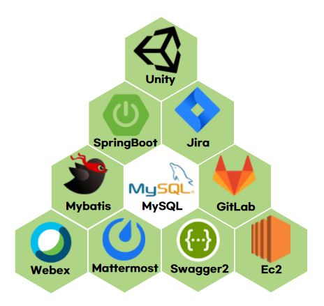
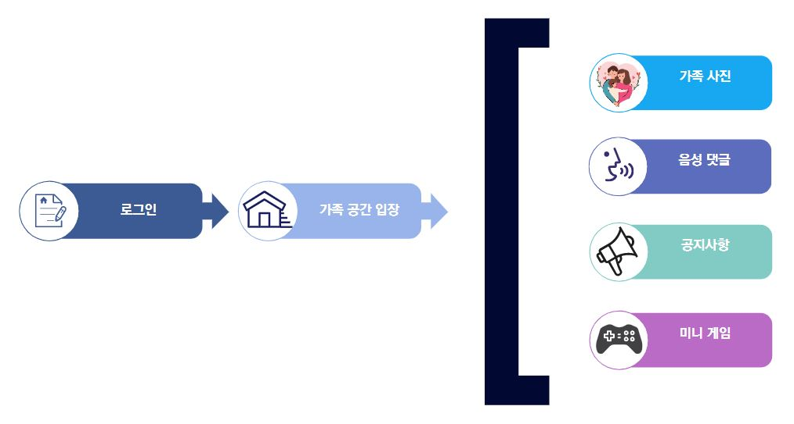

# 📑 프로젝트 소개

- **진행기간**: 2021.04.12 ~ 2021.05.20

- **이름**: 모여봐요 가족의 숲

- **목표**

  - 가족만의 공간을 제공

  - 가족과 함께 사진을 공유하고 음성으로 댓글을 남겨 추억을 기록

  - 간단한 게임을 통해 오락적인 요소를 제공

  - 가족 공지를 통해 중요한 일정을 공유

    

#  👨‍👨‍👧‍👦팀원 소개

박성우 [@uaio88](https://github.com/uaio88)

백태훈 [@whiteburnout](https://github.com/whiteburnout)

엄재웅 [@EomJaeWoong](https://github.com/EomJaeWoong)

김영현 [@KimYH-KU](https://github.com/KimYH-KU)

신인섭 [@InSub-Shin](https://github.com/InSub-Shin)

# ⚙️ 개발환경

</img>

# 🕹️주요 기능

</img>

#  :house_with_garden:실행 화면

</img>

</img>

</img>

</img>

</img>

</img>

# :page_facing_up: 프로젝트 세팅 방법

- [ ] Front-End
  - Unity
    1. Unity Hub에서 버전 2020.3.4f1 설치
    2. Unity Hub에 폴더 exec/unity 추가 후 실행
  - Vue.js
    1. cd exec/mogasupClient/mogasup
    2. yarn install
    3. yarn run serve
- [ ] Back-End
  1. BackEnd.zip Unzip
  2. pom.xml 파일을 /mogasupServer 로 이동
  3. application.properties 파일을 /mogasupServer/src/main/resources 로 이동
  4. STS 에서 mogasupServer 디렉토리 추가
  5. Rus As -> Spring Boot Application으로 실행
- [ ] DB
  1. A102Dump.zip 를 UnZip하여 DB 설정